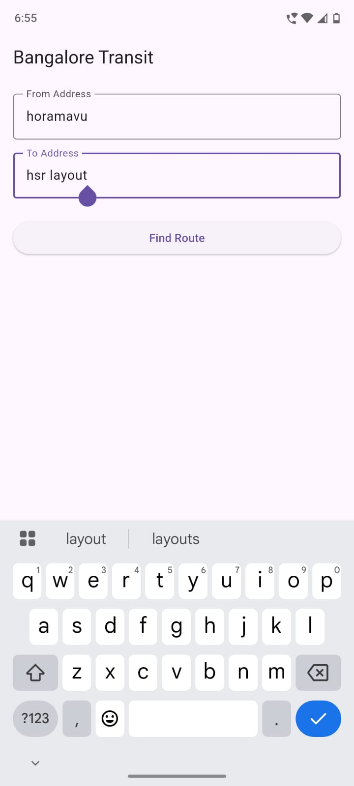
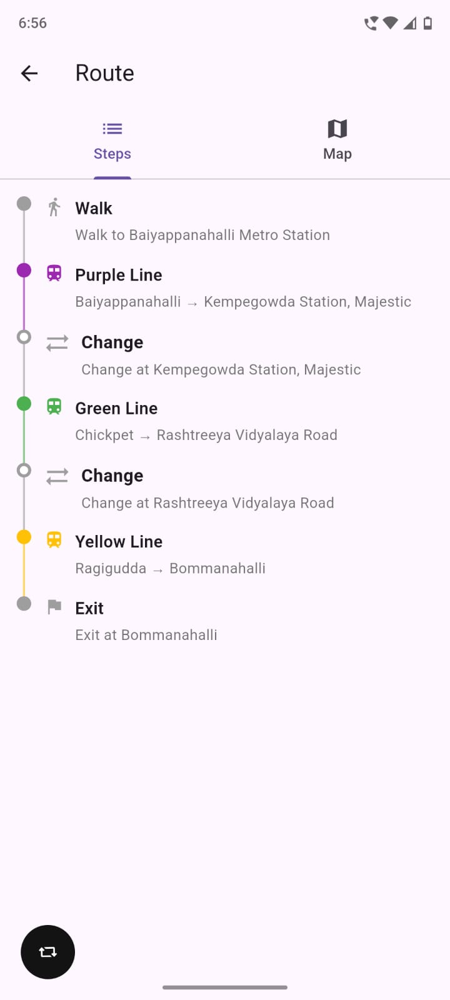
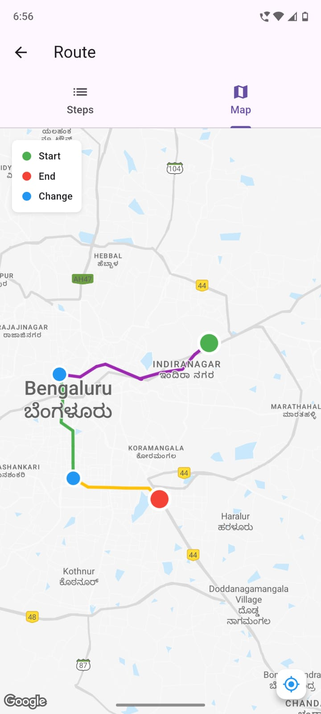

# Bangalore Public Transport Planner 

A Flutter-based mobile app that helps users plan metro journeys across Bangalore.

## Features
- Address → metro route planning
- Nearest station detection
- Line-aware routing with transfers
- Interactive Google Maps view
- Colored metro lines & interchange markers
- Production backend deployment

## Tech Stack
- Flutter (Frontend)
- Node.js (Backend)
- Google Maps SDK
- OpenStreetMap / Nominatim
- Graph algorithms (BFS)

## Architecture
Flutter App → REST API → Routing Engine → Map Visualization

## Screenshots

  
  
  

## Future Improvements
- Bus + metro multimodal routing
- Fare and time estimation
- Live arrival data
